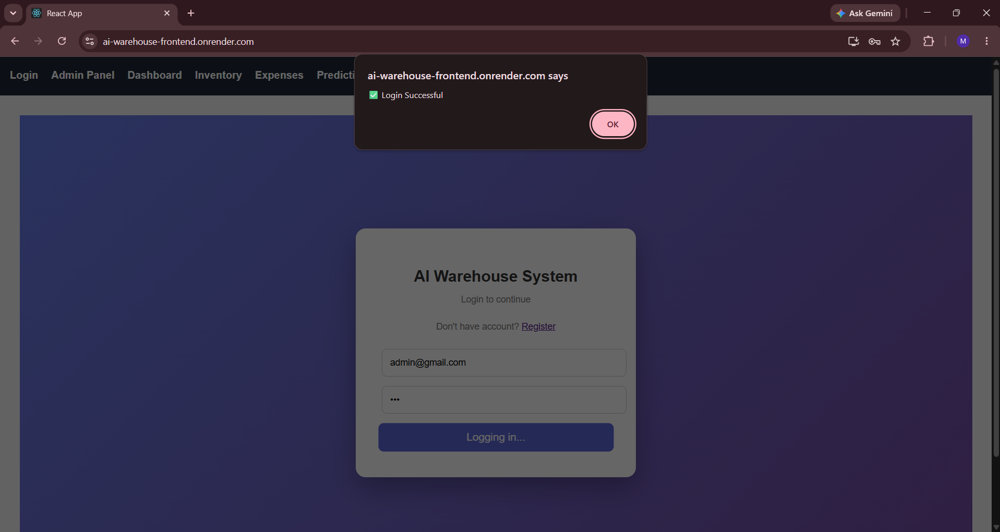
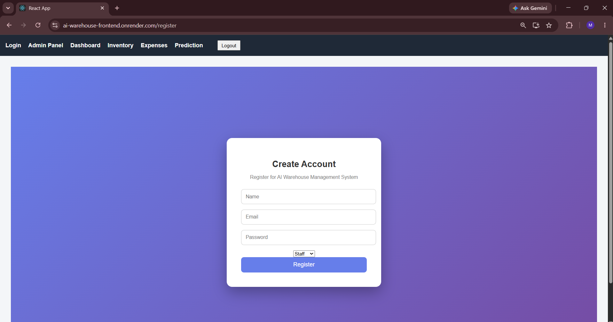
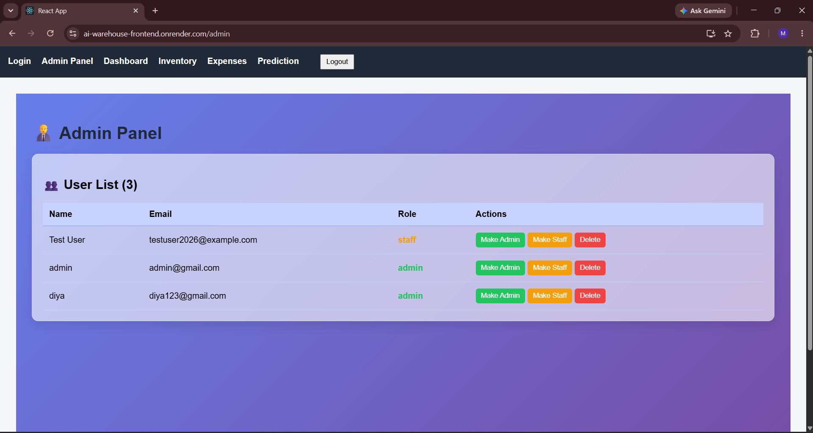
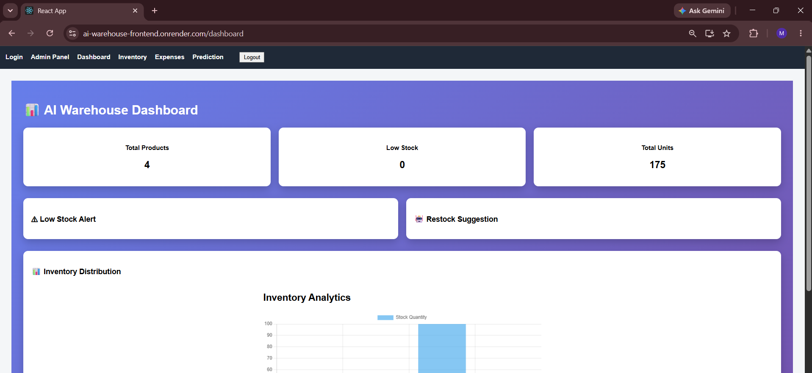
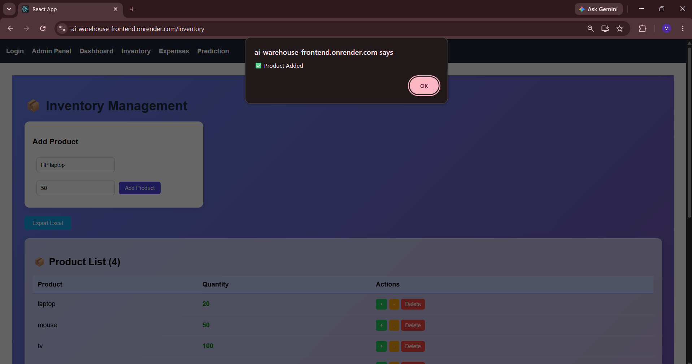
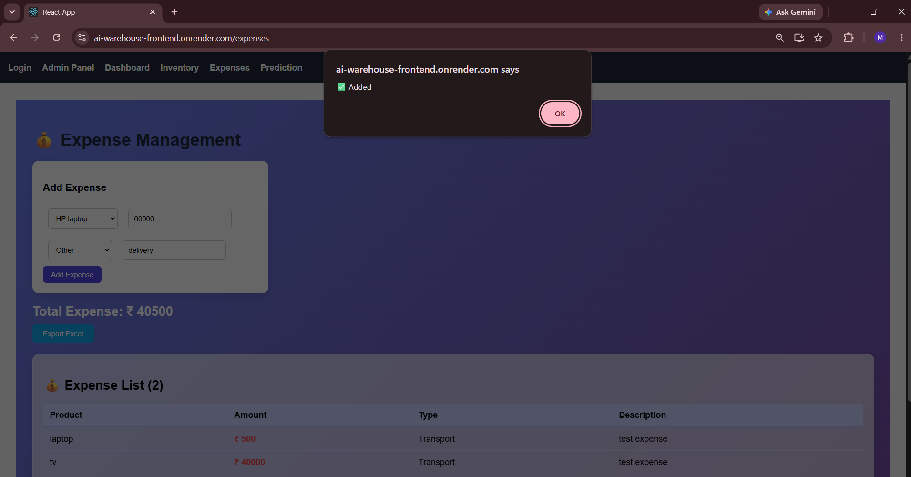
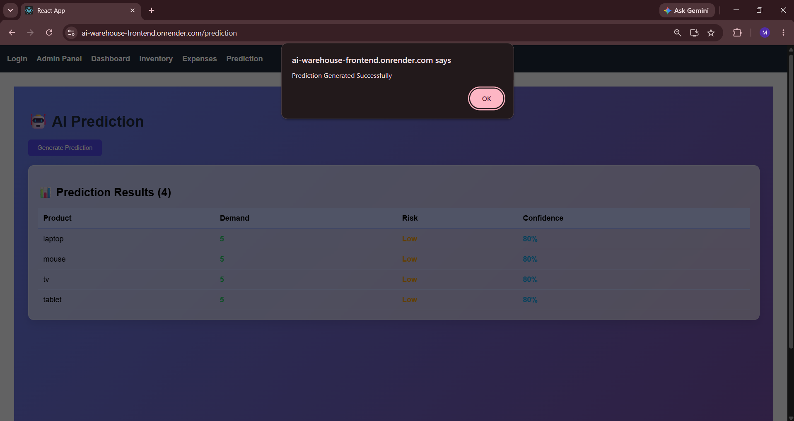

# 🚀 AI-Driven Warehouse and Expense Management System

A full-stack web application designed to manage warehouse inventory, stock operations, expenses, users, and AI-based demand prediction through a centralized dashboard.

## 🌐 Live Demo

Live Application:
https://ai-warehouse-frontend.onrender.com

GitHub Repository:
https://github.com/milipatel575/AI-Warehouse-Management-System

---

## 📌 Project Overview

The AI-Driven Warehouse and Expense Management System is a full-stack web application developed to simplify warehouse inventory and expense management.

The system provides a centralized dashboard where users can manage products, monitor stock levels, track expenses, manage users, and generate demand predictions.

The project combines a React.js frontend with a Node.js and Express.js backend, MongoDB Atlas for database management, and Python-based demand prediction functionality.

---

## ✨ Key Features

### 🔐 Authentication & User Management

- User registration
- User login
- Role-based user management
- Admin user management
- Update user roles
- Delete users
- Protected application pages

### 📊 Dashboard

- Centralized warehouse overview
- Inventory information
- Stock monitoring
- Low-stock information
- Expense information
- Data visualization

### 📦 Inventory Management

- Add new products
- Update product information
- Increase and decrease stock quantity
- Delete products
- Monitor inventory levels
- Track stock history
- Low-stock monitoring

### 💰 Expense Management

- Add expenses
- Select products
- Record expense amount
- Categorize expenses
- Add expense descriptions
- View expense records
- Monitor total expenses

### 🤖 AI Demand Prediction

- Generate product demand predictions
- Analyze inventory-related information
- Display predicted demand
- Support better inventory planning

### 👨‍💼 Admin Panel

- View registered users
- Manage user roles
- Delete users
- Manage administrative information

---

## 🛠️ Technologies Used

### Frontend

- React.js
- JavaScript
- HTML5
- CSS3
- Axios

### Backend

- Node.js
- Express.js
- REST API

### Database

- MongoDB
- MongoDB Atlas
- Mongoose

### AI / Prediction

- Python
- Demand prediction module

### Development Tools

- Visual Studio Code
- Git
- GitHub

### Deployment

- Render
- MongoDB Atlas

---

## 🏗️ System Architecture

```text
                    ┌─────────────────────┐
                    │       User          │
                    └──────────┬──────────┘
                               │
                               ▼
                    ┌─────────────────────┐
                    │   React Frontend    │
                    │      (Render)       │
                    └──────────┬──────────┘
                               │
                            REST API
                               │
                               ▼
                    ┌─────────────────────┐
                    │ Node.js + Express   │
                    │      Backend        │
                    │      (Render)       │
                    └──────┬─────────┬────┘
                           │         │
                           │         ▼
                           │   ┌──────────────┐
                           │   │ Python AI    │
                           │   │ Prediction   │
                           │   └──────────────┘
                           │
                           ▼
                    ┌─────────────────────┐
                    │    MongoDB Atlas    │
                    │      Database       │
                    └─────────────────────┘


---

## 📂 Project Structure

```text
AI_Warehouse_System/
│
├── ai/
│   ├── demandPrediction.js
│   └── predict.py
│
├── config/
│   └── db.js
│
├── controllers/
│   ├── authController.js
│   └── productController.js
│
├── models/
│   ├── Expense.js
│   ├── Inventory.js
│   ├── Prediction.js
│   ├── Product.js
│   ├── StockHistory.js
│   └── User.js
│
├── routes/
│   ├── authRoutes.js
│   ├── expenseRoutes.js
│   ├── inventoryRoutes.js
│   ├── predictionRoutes.js
│   └── productRoutes.js
│
├── warehouse-frontend/
│   ├── public/
│   ├── src/
│   │   ├── components/
│   │   └── pages/
│   ├── package.json
│   └── package-lock.json
│
├── server.js
├── package.json
├── package-lock.json
├── .gitignore
└── README.md

---

## ⚙️ Installation & Setup

### 1. Clone the Repository

git clone https://github.com/milipatel575/AI-Warehouse-Management-System.git

Move into the project directory:

cd AI-Warehouse-Management-System

---

## 🔧 Backend Setup

Install backend dependencies:

npm install

Create a .env file in the project root.

Example:

MONGO_URI=your_mongodb_atlas_connection_string
PORT=5000

Never upload your .env file or database credentials to GitHub.

---

## ▶️ Run the Backend

From the project root:

npm start

The backend will normally run on:

http://localhost:5000

You can test the backend using:

http://localhost:5000/

A successful response should indicate that the AI Warehouse backend is running.

---

## 💻 Frontend Setup

Open another terminal and move into the frontend directory:

cd warehouse-frontend

Install frontend dependencies:

npm install

Start the React application:

npm start

The frontend will normally run on:

http://localhost:3000

---

## 🔐 Environment Variables

The backend uses environment variables for sensitive configuration.

Example:

MONGO_URI=your_mongodb_atlas_connection_string
PORT=5000

The actual MongoDB Atlas connection string should remain private.

Make sure .env is included in .gitignore.

Do not commit .env or any database credentials to GitHub.

---

## ☁️ Deployment

The application is deployed using:

- Frontend: Render Static Site
- Backend: Render Web Service
- Database: MongoDB Atlas

The deployed React frontend communicates with the deployed Node.js and Express.js backend through REST APIs.

### 🌐 Live Application

https://ai-warehouse-frontend.onrender.com

---

## 📸 Screenshots

### 🔐 Login



### 📝 Registration



### 👨‍💼 Admin Panel



### 📊 Dashboard



### 📦 Inventory Management



### 💰 Expense Management



### 🤖 AI Demand Prediction



### 👨‍💼 Admin Panel

Screenshot will be added.

---

## 🔮 Future Enhancements

Possible future improvements include:

- Improved AI demand forecasting
- Advanced analytics and reporting
- Automated low-stock notifications
- More detailed inventory charts
- Improved authentication and security
- Additional warehouse management features
- Improved mobile responsiveness
- More advanced inventory forecasting

---

## 🎓 Project Purpose

This project was developed as an academic and practical full-stack development project to gain hands-on experience with:

- Frontend development
- Backend API development
- Database integration
- AI-based prediction
- Authentication and user management
- REST API integration
- Git and GitHub
- Cloud deployment

---

## 👩‍💻 Author

Mili M Patel

B.Tech Computer Engineering Student

GitHub:
https://github.com/milipatel575

---

## ⭐ Project Highlights

- Full-stack web application
- React.js frontend
- Node.js and Express.js backend
- MongoDB Atlas database
- AI-based demand prediction
- Role-based user management
- Inventory and expense management
- Cloud deployment using Render
- Version control using Git and GitHub